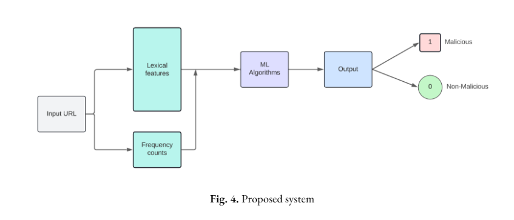

# Malicious-URL-detection

All the codes and datasets of each phase implementation are available in their respective folders. 
All of the code files are in .ipynb file format. 
If you are using Jupyter notebook, make sure that your code file and datasets are in the same path/folder and execute the code file with correct filename. 
If you’re using Google Colab or any other cloud platform please upload the datasets into the platform first and then execute the code. 

The Research work for Malicious URL Detection is divided into 4 phases. 
 Phase 1 - Familiarizing concepts related to our research area.
 Phase 2 - Extracting basic features of URL and classifying using ML algorithms.
 Phase 3 - Implementing CNN with One-hot character level encoding.
 Phase 4 - Implementing ML and DL algorithms on a dataset with more features.

In Phase 1, we familiarized concepts related to our project. In this phase, we collected different datasets to work on and read some research papers that are already present in this domain. All of the above-mentioned work in Phase 1 is provided in the Phase_1 folder.

In Phase 2, since we had familiarized with concepts we took some of the collected datasets and developed a Machine Learning Model for classifying URLs. For Data Pre-processing, we extracted 23 features for 2 datasets i.e. a dataset from University of Brunswick and a dataset from Kaggle. The datasets that are used and code for pre-processing and implementation of ML models are in the folder Phase_2. For detailed 23 features, please check our report.

In Phase 3, we implemented a CNN model with one hot character level encoding. Here, the dataset we used is from PhishTank for Phishing URLs and Common Crawl Foundation for Legitimate URLs. We also used K fold cross validation and Train Test split and evaluated the model. You can find all code files and datasets used in Phase_3 folder.

In Phase 4, we developed a model for detecting malicious urls using different ML and DL algorithms. For building a model we used more number of features here. Regarding Datasets, we used 3 different datasets here. In Data Pre-processing, we extracted character count of each character in URL and Host, Domain and Full URL Based Features of an URL. So, total number of features extracted here is 93 and one class variable. In this phase, we implemented multiple ML and DL models such as CNN, CNNwithLSTM and CNNwithBiLSTM. All of the above mentioned datasets and Code are present in Phase_4 folder.

## Data Preprocessing 
The URLs in the dataset are preprocessed in two ways as shown below. 

**Character Frequency** count We took a URL and a dictionary of 58 characters which include 26 alphabets, 10 numbers(0-9), and special symbols like @,#,!..etc. And for each URL we counted the number of appearances of each character in that URL. Then normalized the counts of characters using feature scaling also known as Min-Max normalization.

**Lexical features** The lexical features include hostname-based and full URLbased features like digit count in the hostname, base URL length, etc.

The extracted features are then normalized and given to machine-learning algorithms like Random forest, SVM, etc., and deep-learning algorithms like CNN, LSTM, and Bi-LSTM. The proposed method is as shown in the below figure.

